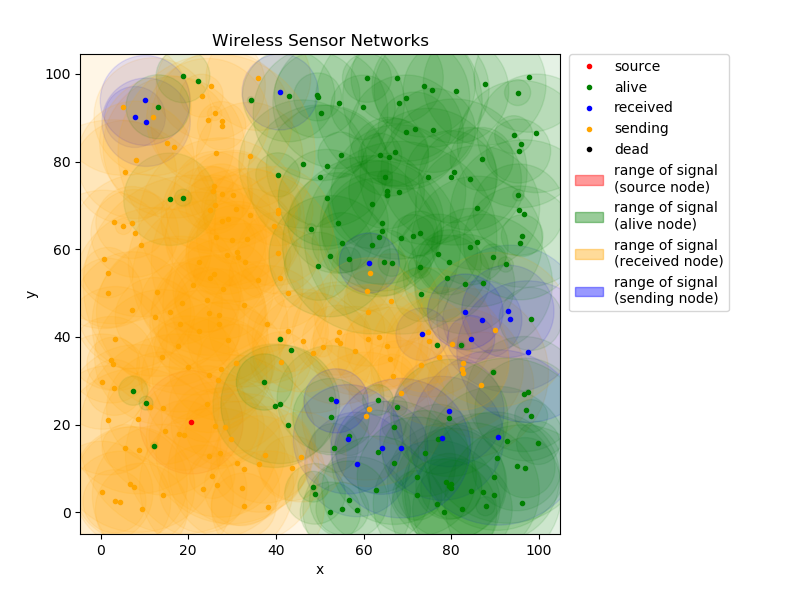

# 无线传感网实验 实验报告

**学院：计算机科学与技术学院**

**指导教师：李瑞、蒋志平**

**项目成员：**

- 罗阳豪 16130120191
- 方浩杰 16130120201

## 1. 实验背景与题目要求

在⽆线多跳⾃组织⽹络环境下，⾼效地将关键数据从⽹络的⼀端扩散⾄全⽹是多跳⾃组织⽹络中⾮ 常重要的重要之⼀，⼴泛⽤于⽹络控制、公共数据⼴播、时间同步等，这种数据⼴播协议⼀般称为 数据分发协议。

分发协议本质是⼀种⼴播协议，⽬的是让环境中所有的节点都收到消息。但分发协议在⽆线多跳⽹ 络中存在多⽅⾯的权衡与设计挑战，例如：

- 应实现总体节能，分发协议应尽可能减少⽆线发送的次数，延⻓⽹络的⼯作寿命；
- 应实现个体节能 ，应降低对某个特定节点的发送次数，当此节点失效时，可能会影响整个⽹络的 ⼯作；
- 应尽量减⼩⽹络跳数，⽹络跳数过多，传输成功率会下降，同时传输时延会上升

**题目：**

1. 在 MATLAB 或 Python 中模拟 N(N > 100) 个节点的多跳传感⽹络，该 N 个节点随机分布在 100m * 100m 的正⽅形 2 维平⾯。每个节点的通信半径符合正态分布 $r \thicksim N(\mu, \sigma^2)$ ；进⼀步，假设当两个节点距离为 d 时，通信成功率 $t = 1 - \frac{d^2}{r_1r_2}$ 。每个节点⼀些基础物理信息：id，总电量，单次发射耗电量；
2. 设计⾃⼰的数据分发协议：
   1. 基本要求：在不考虑电量的情况下，可实现从任意选定的⼀点将信息分发⾄全⽹
   2. 进阶要求：在考虑电量的情况下，实现从任意选定的⼀点将信息分发⾄全⽹
   3. ⾼阶要求：在考虑电量的情况下，提出⼀种最优的数据分发策略
3. 可视化多跳⽹络，并通过简单的过程动画展示分发过程

## 2. 实验思路与过程

### 2.1 模拟无线传感网并将其可视化

该项目使用 Python3 实现，使用数学库 `numpy` 生成所需的随机数和进行一些节点坐标的运算，使用 `matplotlib` 进行数据可视化，使用 `PyQt5` 作为数据可视化的图形引擎，并使用 `coloredlogs` 为打印在终端的 log 提供一些人类友好的色彩。

无线传感网是由若干孤立的节点构成的，它们一般是具有通信能力的小型嵌入式设备，它们可以独立地收、发消息。所以应该将其实现为一个节点类 `WsnNode` ，这样一个类包含坐标、电量、发送消息队列、接收消息队列等属性，并实现有至少收发消息的方法。并且由于这些节点是独立运作的，所以很适合将其运行放在独立线程中，一个节点一个线程。所以这样一个线程也是 `WsnNode` 类的属性。

对于一个无线传感网来说，节点应该能够被添加、删除，并且为了实验可控，它还应该能够控制节点的开启和关闭。所以将这些对节点的管理和操作可以打包为一个节点管理者类 `WsnNodeManager` 。通过节点管理者，我们可以批量创建节点、同时将这些节点开启（启动这些节点的节点线程）、同时将它们关闭（通知这些节点的节点线程退出）。

节点及其管理者并不是一个无线传感网的全部，在真实环境下，空间也是无线传感网的一部分，空间作为无线传感网节点间通信的“介质”，能够容纳无线电信号，通过一些物理过程（比如随着传播距离增加而削弱信号强度），并且最终带着被物理规律过滤过的信号，概率地送达可能的接收者。所以再实现一个 `WsnMedium` 类，以模拟这个过程，一个无线传感网应该只有一个介质对象，它是被所有节点共享的。介质类提供“传播”的方法，接收消息作为参数，用数学方法模拟物理过程，然后概率地将消息放到可能的目标节点的接收消息队列。其实放置消息到接收消息队列原则上应该是节点的网络接口卡做的事情，但是为了简化设计，把这一部分交给了介质。

作为通信协议的一部分，消息除了内容本身，还带有其它的信息，以达到协调传输过程的目的。在真实情况下这些额外信息和消息内容本身会被按照一定的格式包装在一个或多个分组中，并编码。但是编解码、封包解包并不是这个实验的重点，所以我们用基类 `BaseMessage` 及其各种子类来表示，根据协议需要，类除了消息内容本身，还会有额外的属性。所有消息都会是 `BaseMessage`的对象或其子类的对象，它们能在节点与介质之间交换。

节点、节点管理器、介质、消息，构成了一个无线传感网。将它们初始化，让它们跑起来，就能模拟一个无线传感网的工作。但是如何将其工作过程可视化呢，除了无线传感网工作时打的成吨的 log ，我们还使用 `matplotlib` 在一个平面坐标系上绘制一些点和圆来表示节点和节点的通信半径，并用不同的颜色来区分节点的不同状态。

我们在一个独立线程上不停地检查网络上各个节点的状态，并且将变化更新到图像上。通过图像表示的节点状态的变化，我们可以直观地了解这个网络的工作情况。这些能力被我们打包在旁观者类 `Bystander` 中。它除了能在网络工作时实时呈现网络状态，还会在网络停止后将记录的每一帧结果以 `.gif` （取决于系统支持）和 `.html` 、 `.png` 文件的形式持久化。

由此，我们搭建了一套实验框架，接下来只需要去实现和调整这里面节点的行为，就能够进行实验验证。

### 2.2 实现基本要求

> 基本要求：在不考虑电量的情况下，可实现从任意选定的⼀点将信息分发⾄全⽹

这个要求其实基本就是没有要求，只要求消息送达。我们很容易能够想到一个能够迅速传播消息的方法“广播风暴”。就是，源头节点不停地重复发送同一个消息，收到这个消息的节点也不停重复地转发这个消息。它的效果如下图所示

## 3. 实验总结

ppp